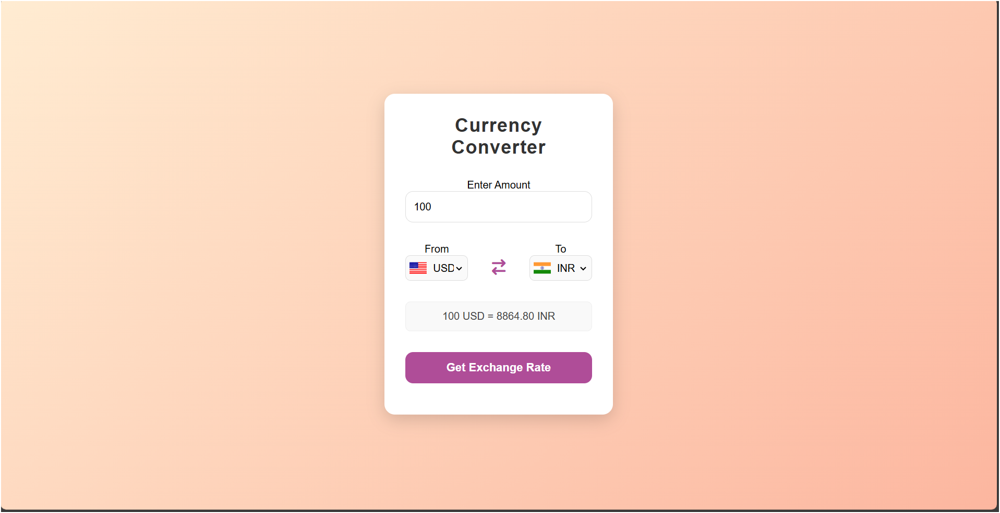

🌍 Currency Converter

A simple yet elegant Currency Converter web application built using HTML, CSS, and JavaScript.
It allows users to convert one currency to another in real time using live exchange rates.

✨ Features

✅ Real-Time Conversion – Instantly converts currencies using live API data.
✅ Country Flags & Codes – Displays flags and codes for better visual clarity.
✅ Swap Functionality – Easily swap between “From” and “To” currencies.
✅ Responsive Design – Works perfectly on both mobile and desktop devices.
✅ Modern UI – Smooth gradients, clean layout, and beautiful shadow effects.

🛠️ Technologies Used
Component	                Description
HTML5	                 Structure and layout of the app
CSS3	                 Styling with gradients, shadows, and responsiveness
JavaScript (ES6)	     Logic for fetching exchange rates and DOM manipulation API	Real-time currency exchange data source

📁 Project Structure
Currency-Converter/
│
├── index.html          # Main HTML file  
├── style.css           # Stylesheet for layout and design
├── js 
|   ├── app.js              # Contains main logic for fetching converting  
|   |__ code.js             # Includes country codes and currency mapping  
|
└── README.md           # Project documentation  

⚙️ How It Works

Enter the amount you want to convert.

Choose your From and To currencies from the dropdown menus.

Click “Get Exchange Rate” to view the converted amount.

Optionally, click the swap icon to reverse currencies.

🚀 Getting Started
Clone the repository
git clone https://github.com/yourusername/Currency-Converter.git

Open the project

Navigate to the folder and open index.html in your browser.

🧩 Files Overview
code.js

Contains mappings of country codes and currency codes used for dropdowns and flag icons.

app.js

Handles:

Fetching live exchange rates via API

Updating UI dynamically

Swap currency functionality

style.css

Defines the elegant gradient background, input styles, buttons, and responsive design.

💡 Example
100 USD = 8864.80 INR

🎨 UI Preview

The application features a soft gradient background with a minimalistic card-style converter box for an elegant look and smooth user experience.

📷 Screenshot

🤝 Contributing

Contributions are welcome!

Fork this repository

Create a new branch (feature-new)

Commit your changes

Open a pull request

🧠 Future Enhancements

🌐 Add Dark/Light mode toggle

💾 Save recent conversions

📊 Display historical exchange rate graphs